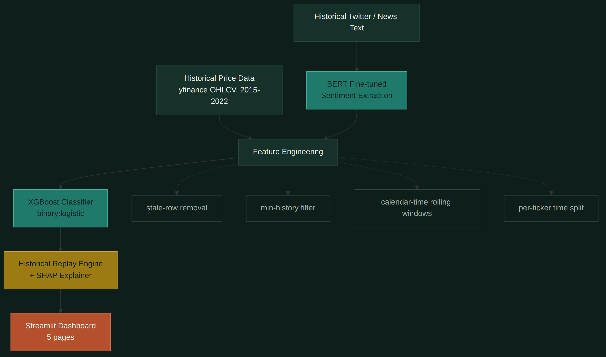
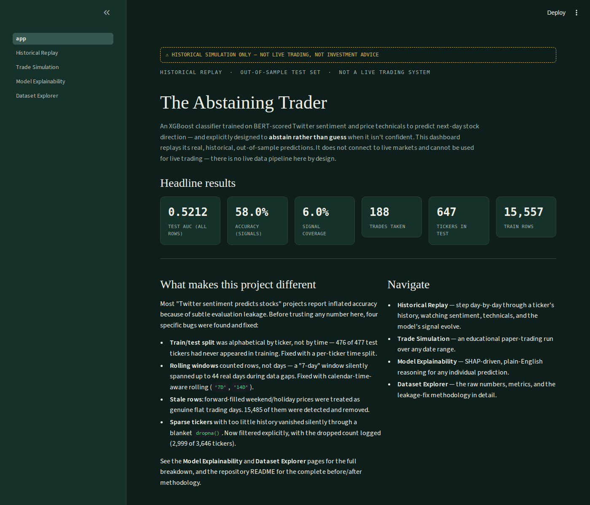
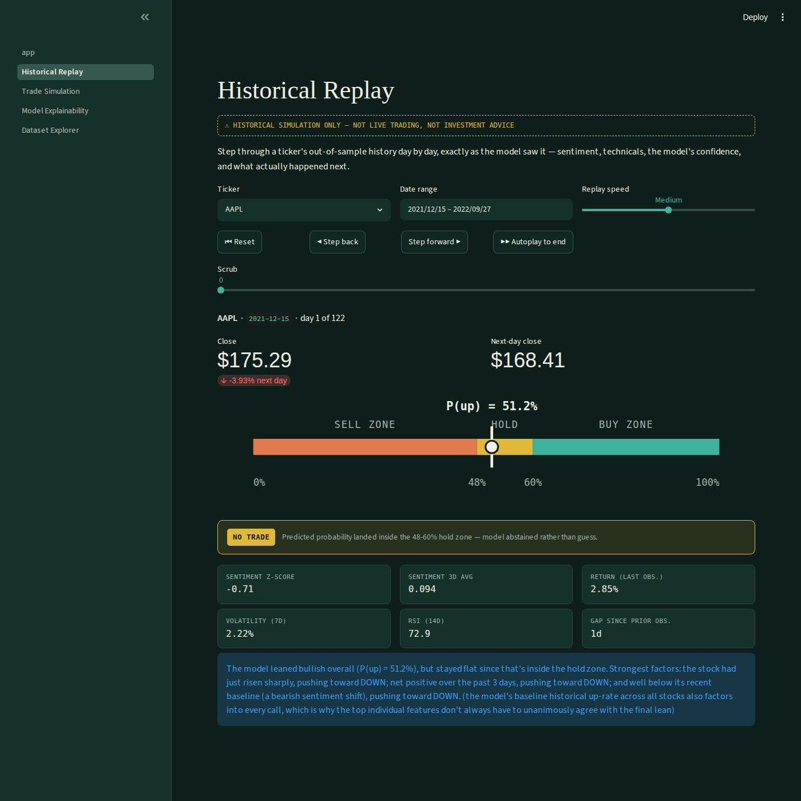
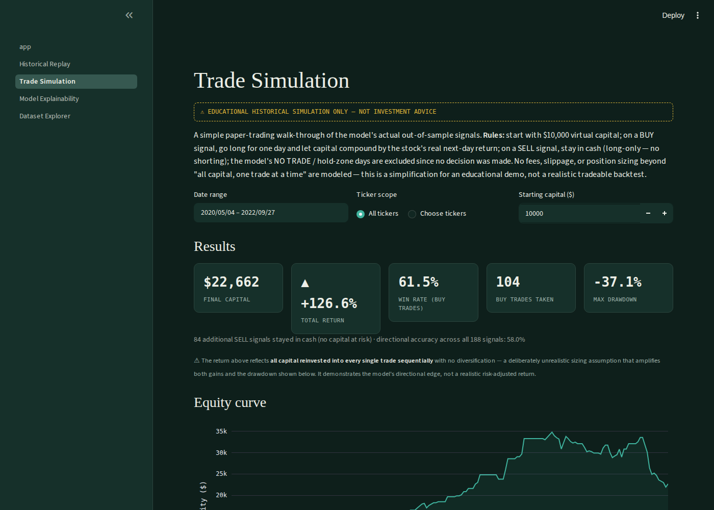
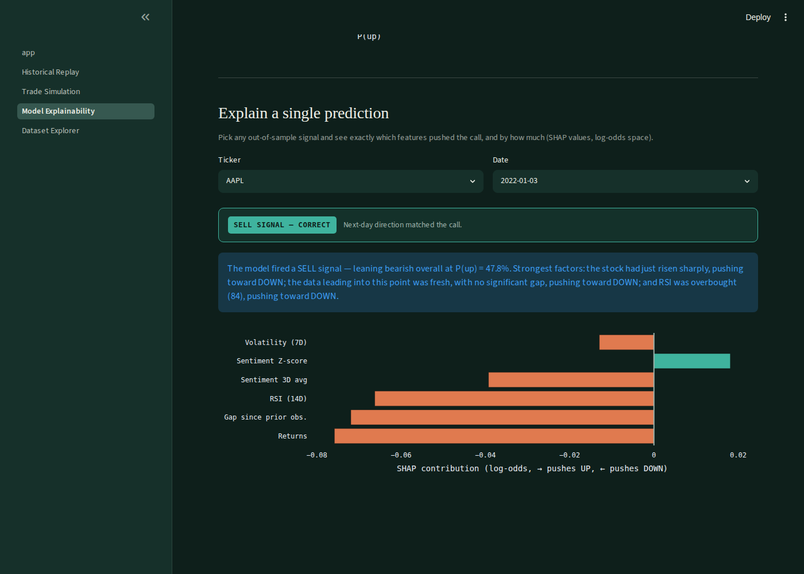
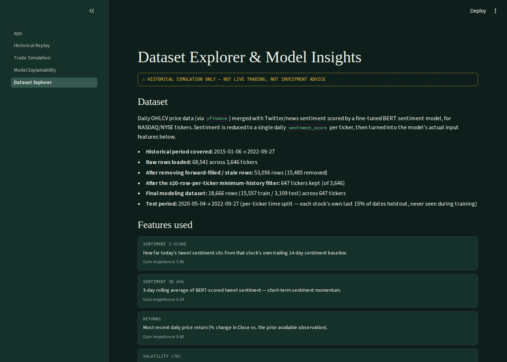

# The Abstaining Trader — Historical Replay System

A stock-direction prediction project (XGBoost + BERT-scored Twitter sentiment) presented as an honest,
fully historical replay and explainability dashboard — **not a live trading system.**



## Why "historical replay" instead of live prediction

The model was trained and evaluated entirely on historical data (2015–2022). There is no live market
data pipeline, no live tweet ingestion, and no live BERT inference in this repository — by design, not
by omission. This dashboard exists to **show how the model actually behaved on real, out-of-sample
historical days**, with full transparency about its accuracy, its confidence calibration, and the
evaluation bugs that were found and fixed before any of these numbers were trusted.

## Live demo

Deployed on Streamlit Community Cloud: *(add your deployed URL here after deploying — see
[Deployment](#deployment) below)*

## Screenshots

| Overview | Historical Replay |
|---|---|
|  |  |

| Trade Simulation | Model Explainability |
|---|---|
|  |  |

| Dataset Explorer |
|---|
|  |

## Features

- **Historical Replay** — step day-by-day (or autoplay) through any test-set ticker's history, watching
  sentiment, technicals, the model's confidence gauge, and the actual outcome unfold together.
- **Prediction Explanation Panel** — every prediction comes with a SHAP-driven plain-English explanation
  ("pushed toward UP because returns were positive and RSI was oversold..."), plus the underlying SHAP
  contribution chart.
- **Historical Performance Dashboard** — accuracy, precision, recall, F1, ROC AUC, confusion matrix,
  feature importance, confidence distribution, and prediction distribution, all computed on the real
  out-of-sample test set.
- **Trade Simulation** — an educational paper-trading walkthrough starting from $10,000 virtual capital,
  with an equity curve, win rate, drawdown, and a full trade log. Clearly labeled as an educational
  simulation, with its sizing assumptions stated explicitly.
- **Dataset Explorer / Model Insights** — the data source, historical coverage, sample counts, every
  feature's definition, and a filterable/downloadable view of the underlying data.

## The methodology (why these numbers can be trusted)

The first version of this pipeline reported a misleadingly high accuracy. Four separate bugs, all
stemming from how the raw dataset handles dates, were found and fixed:

| Bug | What was happening | Fix |
|---|---|---|
| **Train/test split** | Rows sorted alphabetically by ticker, then sliced 85/15 by position — 476 of 477 test tickers had never appeared in training | Per-ticker time split: each stock's own last 15% of dates held out, so every ticker appears in both train and test |
| **Rolling windows** | `.rolling(7)` / `.rolling(14)` counted rows, not days — a "7-day" window silently spanned up to 44 real days during data gaps | `.rolling('7D', on='Date')` / `.rolling('14D', on='Date')` — every window now means an actual calendar period |
| **Stale rows** | Weekend/holiday rows forward-filled with the prior trading day's OHLCV were treated as genuine zero-movement days | 15,485 forward-filled duplicate rows detected and removed before any feature was computed |
| **Sparse tickers** | Tickers with too little history for a 14-day window vanished silently through a blanket `dropna()` | Explicit ≥20-row minimum per ticker, with the dropped count logged (2,999 of 3,646) instead of hidden |

A fifth, more subtle issue was found while building this dashboard: **SHAP's `TreeExplainer` by default
respects the model's recorded `best_iteration` attribute (39 of 139 trees) and would have silently
explained a different, smaller model than the one actually producing predictions** (which uses the full
139-tree booster). The `best_iteration`/`best_score` attributes are stripped before building the
explainer so SHAP values are mathematically consistent with the deployed model's real output (verified
to reconstruct `pred_prob` to within 1e-7).

## Results

| Metric | Value |
|---|---|
| Test AUC (all 3,109 out-of-sample rows) | 0.5212 |
| Accuracy on high-confidence signals | 58.0% |
| Precision / Recall / F1 (signals) | 61.5% / 62.1% / 61.8% |
| Signal coverage | 6.0% (188 / 3,109) |
| Tickers in test set | 647 (100% also seen in training) |
| Test period | 2020-05-04 → 2022-09-27 |

Feature importance (gain): `gap_days` 8.46, `returns` 8.40, `rsi` 7.40, `volatility` 7.10, `sent_ma_3`
6.20, `sent_zscore` 5.86. Price/technical features outweigh sentiment for this dataset and period.

This sits within the range reported across published academic work on sentiment-driven stock prediction,
where careful, leakage-free evaluations tend to land between 50% and 60% — figures well above that in
this literature are usually a sign of evaluation issues like the ones documented above, not a genuinely
higher ceiling.

## Limitations

- **Historical only.** No live data pipeline exists. Sentiment comes from a BERT model scoring historical
  tweet text; nothing here connects to a live feed.
- **Not investment advice.** The trade simulation uses unrealistic sizing (all capital, one trade at a
  time, no fees/slippage) specifically to demonstrate directional edge, not a tradeable return.
- **Single-feature-family model.** Six features (two sentiment, four technical) is a thin signal; the
  model's ~58% accuracy on its most confident 6% of calls reflects that.
- **SHAP values are in log-odds (margin) space**, the only space in which they're mathematically additive
  for this model. They are not converted to probability-point units in the explanations, since that
  conversion isn't additive and would overstate precision.

## Future work

- Add market-relative features (broad index return, sector-relative return) — currently every feature is
  purely stock-specific, so the model has no signal for broad market moves.
- Walk-forward cross-validation across multiple time windows, rather than a single train/test split, to
  get a confidence interval on the reported accuracy rather than a point estimate.
- A genuinely live system would need: a paid tweet-access tier or an alternative text source (X's free API
  tier no longer supports meaningful read volume), a scheduled job to refresh price + sentiment features
  daily, and a re-validation that the model's calibration still holds out-of-time before trusting it.

## Repository structure

```
stock-prediction-historical-replay/
│
├── app.py                          # Overview page (Streamlit entry point)
├── pages/
│   ├── 1_Historical_Replay.py
│   ├── 2_Trade_Simulation.py
│   ├── 3_Model_Explainability.py
│   └── 4_Dataset_Explorer.py
├── utils/
│   ├── data_loader.py              # cached data/model loading
│   ├── theme.py                    # shared dark theme + CSS
│   ├── gauge.py                    # the confidence-gauge SVG
│   ├── explain.py                  # SHAP -> natural language
│   └── trade_sim.py                # paper-trading simulation logic
├── data/
│   ├── historical_replay_dataset.csv   # final features + predictions + SHAP values
│   └── model_meta.json                 # precomputed metrics, feature importance
├── models/
│   └── final_stock_model.json      # trained XGBoost booster
├── assets/                         # architecture diagram, reference plots
├── screenshots/                    # README screenshots
├── .streamlit/config.toml          # dark theme config
├── requirements.txt
└── README.md
```

## Running locally

```bash
pip install -r requirements.txt
streamlit run app.py
```

Opens at `http://localhost:8501`. The dataset and model are pre-built and committed to the repo
(`data/historical_replay_dataset.csv`, `models/final_stock_model.json`) — no training step is required
to run the dashboard. To regenerate them from the raw dataset, see `build_dataset.py` in the project
history (rebuilds the fixed feature pipeline, retrains/predicts, and recomputes SHAP values).

## Deployment

1. Push this repository to GitHub.
2. On [Streamlit Community Cloud](https://streamlit.io/cloud), click **New app**, point it at this repo,
   and set the main file path to `app.py`.
3. Streamlit Cloud installs `requirements.txt` automatically and picks up `.streamlit/config.toml` for
   the dark theme.
4. Once deployed, replace the placeholder link in [Live demo](#live-demo) above with your app's URL.

## How to explain this project in an interview

**Problem statement:** Predict next-day stock price direction using Twitter/news sentiment (scored by a
fine-tuned BERT model) combined with price technicals, and be honest about how hard that actually is.

**Data pipeline:** Daily OHLCV via `yfinance` merged with a daily sentiment score per ticker. The
interesting part of this pipeline isn't the merge — it's everything that had to be fixed afterward:
weekday gaps up to 44 days, forward-filled weekend rows masquerading as real trading days, and thousands
of tickers with too little history to support a 14-day rolling window.

**Feature engineering:** Six features — sentiment z-score and 3-day sentiment momentum, returns, 7-day
volatility, 14-day RSI, and a custom `gap_days` feature recording staleness. `gap_days` exists *because*
of the data-quality issues found, and it turned out to be the single most important feature by SHAP gain
— a concrete example of a bug fix becoming a useful signal.

**Model choice:** XGBoost (`binary:logistic`) over a deep learning approach because the feature set is
small, tabular, and the dataset (after cleaning) is modest — a few hundred rows per ticker. An asymmetric
confidence threshold (act only when P(up) is below 48% or above 60%) was added deliberately, trading
coverage for precision, since an unfiltered prediction on every day would mean acting on noise most of
the time.

**Evaluation methodology — the part worth spending the most time on in an interview:** the first version
of this evaluation reported a misleadingly high accuracy because the train/test split was alphabetical by
ticker rather than temporal (476 of 477 test tickers were unseen during training), and rolling features
were row-count-based rather than calendar-time-based. Fixing both, plus removing forward-filled rows and
explicitly filtering sparse tickers, dropped the apparent performance to a much more modest, defensible
58% accuracy on high-confidence calls (6% coverage) and a 0.52 AUC overall. Walking an interviewer through
*why* the number changed, not just what it is, is the strongest part of this project.

**Limitations:** explained openly above — six features is thin signal, no market-relative context, single
train/test split rather than walk-forward validation, and explicitly no live trading capability.

**Future improvements:** market-relative features, walk-forward CV, and what a real live pipeline would
require (and cost) if this were ever taken further.

## Resume project entry

> **The Abstaining Trader — Sentiment-Driven Stock Direction Model** *(Python, XGBoost, BERT, SHAP, Streamlit)*
> - Built an XGBoost classifier predicting next-day stock direction from BERT-scored Twitter sentiment and
>   price technicals across 647 tickers (2020–2022), with an asymmetric confidence threshold that
>   abstains rather than predicts on low-confidence days.
> - Identified and fixed four data-leakage bugs in the original evaluation (alphabetical vs. per-ticker
>   time-based train/test split, row-count vs. calendar-time rolling windows, forward-filled stale rows,
>   silently-dropped sparse tickers), correcting an inflated accuracy down to a defensible 58% on
>   high-confidence signals (6% coverage, 0.52 AUC overall) — in line with published academic ranges.
> - Built a SHAP-driven explainability layer generating natural-language reasoning for every prediction,
>   and discovered a further inconsistency where the SHAP explainer was, by default, explaining a
>   different (smaller) model checkpoint than the one actually deployed.
> - Designed and deployed a 5-page Streamlit dashboard (historical replay, paper-trading simulation,
>   explainability, dataset explorer) to Streamlit Community Cloud as a fully historical, non-live
>   portfolio demonstration.

## GitHub project description (for the repo's "About" field)

> Historical replay & explainability dashboard for an XGBoost stock-direction model trained on BERT
> sentiment + price technicals — with the data-leakage bugs found and fixed along the way. Not a live
> trading system by design. Built with Streamlit, XGBoost, and SHAP.
